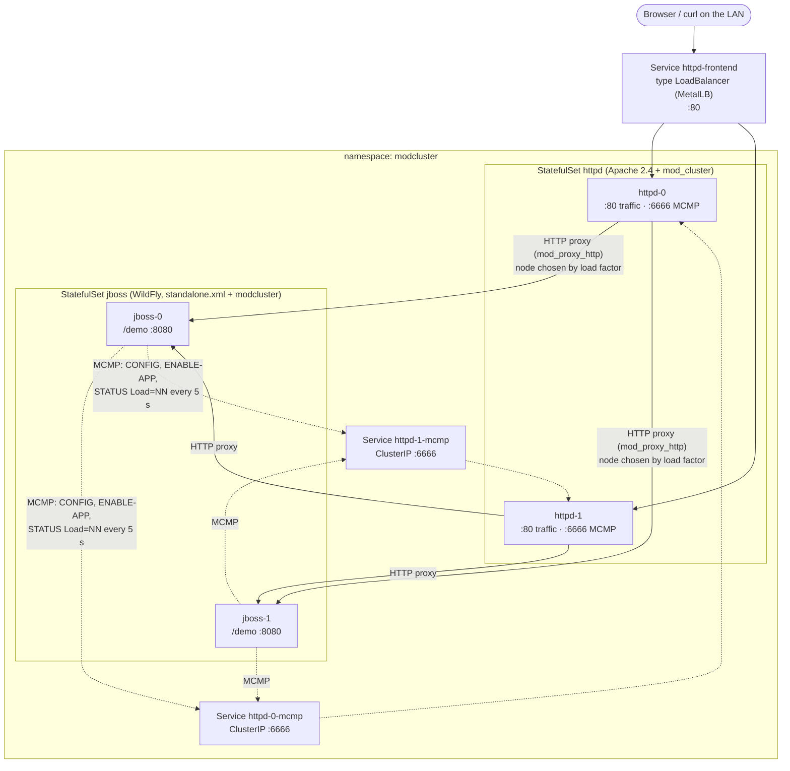

# mod_cluster on Kubernetes — 2 × Apache httpd + 2 × JBoss (WildFly)

A self-contained test project for a home-lab Kubernetes cluster:

* **2 Apache httpd 2.4** pods running **mod_cluster** (`mod_manager` + `mod_proxy_cluster`, compiled from source)
* **2 JBoss application servers** (WildFly 41 on Java 21, the upstream of JBoss EAP) with
  the **mod_cluster subsystem registered in `standalone.xml`**
* A **dummy web app** (`/demo`) with endpoints that show which node served you
  and endpoints that put artificial load on a node
* Load balancing driven by **the load factor each JBoss computes from its own
  heap, busy requests and CPU**, pushed to Apache over mod_cluster's MCMP channel

Everything here was built and run end-to-end locally (docker compose, same
images) while writing this README. The measured numbers are in
[docs/how-load-balancing-works.md](docs/how-load-balancing-works.md#4-measured-on-the-local-compose-stack).

---

## Contents

1. [Architecture](#1-architecture)
2. [Repository layout](#2-repository-layout)
3. [Prerequisites](#3-prerequisites)
4. [Build and push the images](#4-build-and-push-the-images)
5. [Deploy to Kubernetes](#5-deploy-to-kubernetes)
6. [Verify](#6-verify)
7. [Test load-based balancing](#7-test-load-based-balancing)
8. [Component details](#8-component-details)
9. [Operations](#9-operations)
10. [Run locally without Kubernetes](#10-run-locally-without-kubernetes)
11. [Clean up](#11-clean-up)

Further reading:
[How the load balancing works](docs/how-load-balancing-works.md) ·
[standalone.xml changes](docs/standalone-xml-changes.md) ·
[Troubleshooting](docs/troubleshooting.md)

---

## 1. Architecture



**Two flows:**

| Flow | Direction | Port | Purpose |
|---|---|---|---|
| User traffic | LAN → `httpd-frontend` → any httpd → chosen JBoss | 80 → 8080 | Normal requests to `/demo` |
| MCMP (management) | **every** JBoss → **every** httpd | 6666 | Register node, enable `/demo`, report load factor every 5 s, deregister on shutdown |

**Key design decisions**

| Decision | Reason |
|---|---|
| Static proxy list, `advertise=false` | mod_cluster's multicast auto-discovery doesn't work over flannel / most CNIs. |
| One ClusterIP Service **per httpd pod** (`httpd-0-mcmp`, `httpd-1-mcmp`) | Every JBoss must register with *each* Apache separately (each keeps its own node table). A per-pod Service gives a stable DNS name *and* a stable IP that survives httpd restarts. |
| StatefulSets for both tiers | Stable names. JBoss pod name = mod_cluster node name = JVMRoute in `JSESSIONID`, so sticky sessions survive rescheduling. |
| HTTP connector instead of AJP | One less protocol and module; `mod_proxy_http` is enough. |
| `standalone.xml` (not `standalone-ha.xml`) | As requested; mod_cluster is added to it by a CLI script at image build. Sessions are not replicated — a failed node's sessions are lost (see [§9](#9-operations)). |
| Pod anti-affinity | Spreads the pods over your 2 workers, so the `cpu` metric (a *node*-level load average) actually differs between the two JBoss nodes. |
| NetworkPolicy | Only `app=jboss` pods may reach httpd's MCMP port 6666 (kube-router enforces it). |

---

## 2. Repository layout

```
.
├── README.md                     ← you are here
├── Makefile                      build / push / deploy / test shortcuts
├── apache/
│   ├── Dockerfile                httpd:2.4 + mod_manager + mod_proxy_cluster built from source
│   └── conf/mod_cluster.conf     mod_cluster config (included from httpd.conf)
├── jboss/
│   ├── Dockerfile                WildFly 41 + modcluster in standalone.xml + demo app
│   ├── configure-modcluster.cli  the CLI script that edits standalone.xml at build time
│   └── entrypoint.sh             sets node name, bind address, proxy list from env
├── app/demo.war/                 dummy application (exploded WAR, context /demo)
│   ├── index.jsp                 HTML page, creates a session (sticky)
│   ├── info.jsp                  one-line text, no session (balanced every request)
│   ├── hog.jsp                   retain heap          → raises "heap" metric
│   ├── slow.jsp                  hold a request open  → raises "busyness" metric
│   ├── burn.jsp                  spin CPU             → raises "cpu" metric
│   └── WEB-INF/web.xml
├── k8s/
│   ├── kustomization.yaml        namespace, labels, image names/tags
│   ├── namespace.yaml
│   ├── httpd.yaml                StatefulSet + headless + per-pod MCMP Services + LoadBalancer
│   ├── jboss.yaml                StatefulSet + headless Service
│   └── networkpolicy.yaml
├── scripts/
│   ├── status.sh                 node table + load factor from each Apache
│   ├── traffic.sh                send N requests, count per node / per Apache
│   ├── stress.sh                 load one JBoss pod (heap | busy | cpu | release)
│   └── demo.sh                   guided end-to-end demo
├── local/compose.yaml            same images on docker compose, for a quick local test
└── docs/
    ├── how-load-balancing-works.md
    ├── standalone-xml-changes.md
    └── troubleshooting.md
```

---

## 3. Prerequisites

**Cluster** (matches the home lab this was written for — adjust if yours differs):

| Item | Used for |
|---|---|
| Kubernetes ≥ 1.25, `amd64` nodes, ≥ 2 workers | the workloads (kubeadm 1.30, 2 × 2 vCPU / 4 GB workers is enough) |
| MetalLB (or any LoadBalancer implementation) | external IP for `httpd-frontend` |
| A NetworkPolicy-capable CNI / kube-router | optional; without it the policy is just ignored |
| Pullable registry | `ghcr.io/<you>` or the in-cluster `registry:2` on NodePort 30500 |

Resource requests in total: ~0.6 vCPU and ~1.4 GiB memory.

**Workstation:** `kubectl` pointed at the cluster, Docker (or Podman) with
`buildx`, `make`, `curl`. Building `linux/amd64` images on an Apple-silicon Mac
works through buildx/QEMU emulation (the Apache stage compiles C, expect a
few minutes).

---

## 4. Build and push the images

```bash
# ghcr.io (default REGISTRY=ghcr.io/parthjp80)
echo "$GHCR_TOKEN" | docker login ghcr.io -u parthjp80 --password-stdin
make build TAG=1.0.1

# …or the in-cluster registry (HTTP; containerd on the nodes must trust it)
make build REGISTRY=192.168.1.61:30500 TAG=1.0.0
```

That runs, for each image:

```bash
docker buildx build --platform linux/amd64 -f apache/Dockerfile -t $REGISTRY/modcluster-httpd:$TAG --push .
docker buildx build --platform linux/amd64 -f jboss/Dockerfile  -t $REGISTRY/modcluster-jboss:$TAG  --push .
```

If you used a registry/tag other than the defaults, write it into the
kustomization:

```bash
make set-image REGISTRY=192.168.1.61:30500 TAG=1.0.0
```

> ghcr.io packages are private when first pushed. Make them public, or add a
> pull secret — see [troubleshooting](docs/troubleshooting.md#imagepullbackoff).

**What the builds do**

* `apache/Dockerfile` — stage 1 installs gcc/autoconf/APR headers on top of
  the official `httpd:2.4` image, downloads
  [mod_proxy_cluster](https://github.com/modcluster/mod_proxy_cluster) at a
  pinned commit (the project has no release tags) and compiles `mod_manager.so`
  and `mod_proxy_cluster.so` with `apxs`. Stage 2 is a clean `httpd:2.4` with
  the two `.so` files and `conf/extra/mod_cluster.conf`; the build ends with
  `httpd -t` so a broken config fails the build.
* `jboss/Dockerfile` — stage 1 downloads the WildFly 41.0.1.Final tarball
  (SHA-1 checked), runs `configure-modcluster.cli` against an **embedded
  (offline) WildFly** to add the mod_cluster extension, subsystem and proxy
  socket bindings to `standalone.xml`, and adds the demo app. That stage runs
  on your machine's native platform (`--platform=$BUILDPLATFORM`) because the
  JVM crashes under QEMU when cross-building amd64 on an ARM Mac. Stage 2 is
  `eclipse-temurin:21-jre-noble` (Ubuntu 24.04) for the target platform with
  that WildFly copied in, running as user `jboss` (uid 1001).

> **Why not the official `quay.io/wildfly/wildfly` image?** It is built on
> RHEL 10, which needs an x86-64-v2 (or newer) CPU. Proxmox VMs with the
> default `kvm64`/`qemu64` CPU type are x86-64-v1, and the container exits
> immediately with `Fatal glibc error: CPU does not support x86-64-v2`. The
> Ubuntu 24.04 + Temurin base runs on any x86-64 CPU. If you change the VMs'
> CPU type to `host` (see [troubleshooting](docs/troubleshooting.md#fatal-glibc-error-cpu-does-not-support-x86-64-v2)),
> either base works.

---

## 5. Deploy to Kubernetes

```bash
make deploy          # = kubectl apply -k k8s
make wait            # waits for both StatefulSets, then lists pods & services
```

Expected:

```
NAME          READY   STATUS    NODE
pod/httpd-0   1/1     Running   k8s-worker-1
pod/httpd-1   1/1     Running   k8s-worker-2
pod/jboss-0   1/1     Running   k8s-worker-2
pod/jboss-1   1/1     Running   k8s-worker-1

NAME                     TYPE           CLUSTER-IP      EXTERNAL-IP    PORT(S)
service/httpd            ClusterIP      None            <none>         80/TCP,6666/TCP
service/httpd-0-mcmp     ClusterIP      10.x.x.x        <none>         6666/TCP,80/TCP
service/httpd-1-mcmp     ClusterIP      10.x.x.x        <none>         6666/TCP,80/TCP
service/httpd-frontend   LoadBalancer   10.x.x.x        192.168.1.64   80:3xxxx/TCP
service/jboss            ClusterIP      None            <none>         8080/TCP,9990/TCP
```

Start-up order is handled for you: the JBoss pods have an init container that
waits for the `httpd-N-mcmp` names to resolve, and mod_cluster retries the
registration every 5 s until both Apaches answer.

The `EXTERNAL-IP` comes from the MetalLB pool (`192.168.1.63-66` in this
lab — `.63` is already used by ingress-nginx). If you'd rather go through
ingress-nginx, change `httpd-frontend` to `type: ClusterIP` and point an
Ingress at it; Apache remains the component doing the mod_cluster balancing.

---

## 6. Verify

```bash
LB=$(kubectl -n modcluster get svc httpd-frontend -o jsonpath='{.status.loadBalancer.ingress[0].ip}')

# 1. Both JBoss nodes registered with both Apaches, with a load factor
make status
```
```
== httpd-0 ==
  jboss-1 (http://10.244.1.12:8080)       load=82   status=OK    elected=12
  jboss-0 (http://10.244.2.9:8080)        load=80   status=OK    elected=11
== httpd-1 ==
  jboss-1 (http://10.244.1.12:8080)       load=82   status=OK    elected=10
  jboss-0 (http://10.244.2.9:8080)        load=80   status=OK    elected=9
load: 1..100 (100 = idle, 1 = saturated), 0 = standby, -1 = error
```

```bash
# 2. Requests are spread across nodes (no session → every request balanced)
for i in $(seq 6); do curl -s http://$LB/demo/info.jsp; done
```
```
node=jboss-0 pod=jboss-0 ip=10.244.2.9 proxy=httpd-0
node=jboss-1 pod=jboss-1 ip=10.244.1.12 proxy=httpd-1
...
```

```bash
# 3. Sticky sessions: the JSESSIONID ends in .<node>; you stay there,
#    whichever Apache MetalLB sends you to
curl -s -c /tmp/cj -b /tmp/cj http://$LB/demo/ | grep -o 'Served by <code>[^<]*'
grep JSESSIONID /tmp/cj | awk '{print $NF}'     # …abc123.jboss-0
```

```bash
# 4. The mod_cluster manager page (LAN only)
open http://$LB/mod_cluster_manager
```

The manager page lists every node with its `Load:` value and lets you
enable / disable / stop the `/demo` context per node.

---

## 7. Test load-based balancing

Run the whole thing with `make demo` (or `scripts/demo.sh`), or step by step:

```bash
make traffic                                  # baseline: ~50/50

scripts/stress.sh jboss-0 heap 250            # jboss-0 retains ~250 MB of its 512 MB heap
sleep 20; make status; make traffic           # jboss-0 load factor drops → fewer requests
scripts/stress.sh jboss-0 release

scripts/stress.sh jboss-1 busy 30 120         # 30 requests parked on jboss-1 for 120 s
sleep 20; make status; make traffic           # jboss-1's load factor drops sharply → it gets far less new traffic

scripts/stress.sh jboss-0 cpu 120             # 2 spinning threads (affects the whole k8s node)
```

`stress.sh` runs `curl` **inside** the target pod against its own pod IP, so
the load lands on exactly that node and isn't itself load-balanced.

Results from the local run (see [details](docs/how-load-balancing-works.md#4-measured-on-the-local-compose-stack)):

| Scenario | jboss-0 Load | jboss-1 Load | jboss-0 share | jboss-1 share |
|---|---|---|---|---|
| Both idle | 69 | 78 | 47 % | 53 % |
| ~190 MB heap retained on jboss-0 | 54 | 80 | 41 % | 59 % |
| 30 parked requests on jboss-1 | 88 | 24 | 78 % | 22 % |

Traffic is shared **in proportion to the load factors**, recalculated every
5 seconds — that's the mod_cluster difference from a plain round-robin or
least-connections balancer.

**Also try**

| Test | How | Expected |
|---|---|---|
| Graceful node removal | `kubectl -n modcluster delete pod jboss-0` | httpd log shows `STOP-APP`, `REMOVE-APP`; no errors for `info.jsp`; jboss-0 re-registers when the pod is back |
| Disable a node | Manager page → *Disable Contexts* on jboss-1 | new sessions go to jboss-0, existing jboss-1 sessions continue |
| Apache restart | `kubectl -n modcluster delete pod httpd-0` | JBoss re-sends CONFIG within ~30 s; `make status` shows both nodes again |
| Scale out | `kubectl -n modcluster scale sts jboss --replicas=3` | jboss-2 appears in `make status` and receives traffic — no Apache change needed |

---

## 8. Component details

### 8.1 Apache httpd (`apache/conf/mod_cluster.conf`)

```apache
LoadModule watchdog_module      modules/mod_watchdog.so
LoadModule proxy_module         modules/mod_proxy.so
LoadModule proxy_http_module    modules/mod_proxy_http.so
LoadModule proxy_hcheck_module  modules/mod_proxy_hcheck.so
LoadModule slotmem_shm_module   modules/mod_slotmem_shm.so
LoadModule manager_module       modules/mod_manager.so        # receives MCMP
LoadModule proxy_cluster_module modules/mod_proxy_cluster.so  # routes by load factor

ManagerBalancerName mycluster
ProxyPreserveHost   On
LBstatusRecalTime   5

Listen 6666
<VirtualHost *:6666>
    EnableMCMPReceive                  # only this vhost accepts MCMP
    <Location />
        Require ip 127.0.0.1 10.0.0.0/8 172.16.0.0/12 192.168.0.0/16
    </Location>
    <Location /mod_cluster_manager>
        SetHandler mod_cluster-manager
    </Location>
</VirtualHost>
```

* There is **no `ProxyPass`** — `/demo` is routed because a JBoss node said
  `ENABLE-APP /demo`.
* `mod_proxy_balancer` must *not* be loaded alongside `mod_proxy_cluster`
  (it isn't, in the stock `httpd:2.4` config).
* Every response carries `X-Served-By-Proxy: httpd-N` and the same header is
  passed to JBoss, which `info.jsp` echoes back as `proxy=`.

### 8.2 JBoss / WildFly (`standalone.xml`)

The CLI script adds to `standalone.xml`
([full diff](docs/standalone-xml-changes.md)):

```xml
<extension module="org.jboss.as.modcluster"/>

<subsystem xmlns="urn:jboss:domain:modcluster:6.0">
    <proxy name="default" listener="default" proxies="httpd-proxy-1 httpd-proxy-2"
           advertise="false" balancer="mycluster" status-interval="5"
           excluded-contexts="ROOT,wildfly-services" sticky-session="true" ...>
        <dynamic-load-provider decay="2.0" history="4">
            <load-metric type="heap"     weight="2"/>
            <load-metric type="busyness" weight="2" capacity="40.0"/>
            <load-metric type="cpu"      weight="1"/>
        </dynamic-load-provider>
    </proxy>
</subsystem>

<outbound-socket-binding name="httpd-proxy-1">
    <remote-destination host="${modcluster.proxy1.host:httpd-0-mcmp}" port="${modcluster.proxy1.port:6666}"/>
</outbound-socket-binding>
<outbound-socket-binding name="httpd-proxy-2">
    <remote-destination host="${modcluster.proxy2.host:httpd-1-mcmp}" port="${modcluster.proxy2.port:6666}"/>
</outbound-socket-binding>
```

`entrypoint.sh` starts the server with:

| Flag | From | Effect |
|---|---|---|
| `-c standalone.xml` | — | the profile with mod_cluster |
| `-b $POD_IP` | downward API `status.podIP` | HTTP listener binds the pod IP; **this is the address JBoss registers with httpd** |
| `-Djboss.node.name=$NODE_NAME` | downward API `metadata.name` | node name = JVMRoute = `jboss-0` / `jboss-1` |
| `-Dmodcluster.proxyN.host/port` | `MODCLUSTER_PROXY1/2` env | which Apaches to register with |
| `-bmanagement 0.0.0.0` | — | so kubelet can reach `/health/*` on 9990 |

### 8.3 Load factor in one paragraph

Every 5 s each JBoss computes `load = (2·heap + 2·busyness + 1·cpu) / 5`
(each metric 0…1, averaged over the last 4 samples with decay 2), sends
`STATUS Load = 100 − load·100` to both Apaches, and each Apache hands out new
requests in proportion to those numbers. Full explanation with the source
formulas: [docs/how-load-balancing-works.md](docs/how-load-balancing-works.md).

### 8.4 Demo application (`app/demo.war`)

| URL | Session | What it does |
|---|---|---|
| `/demo/` (`index.jsp`) | yes | HTML page: node, pod IP, Apache, session id, hit count, heap, load avg |
| `/demo/info.jsp` | no | `node=… pod=… ip=… proxy=…` — used by `traffic.sh` |
| `/demo/hog.jsp?mb=250` / `?release=1` | no | retain / free heap (capped at ~85 % of max) |
| `/demo/slow.jsp?sec=60` | no | holds the request (and a worker thread) for N s |
| `/demo/burn.jsp?sec=60&threads=2` | no | spins CPU threads in the background, returns immediately |

Plain JSPs, so no Maven/Gradle build is needed; WildFly compiles them on
first request.

### 8.5 Kubernetes objects (`k8s/`)

| Object | Notes |
|---|---|
| `StatefulSet/httpd` (2) | `podManagementPolicy: Parallel`, anti-affinity, TCP probes on 80 / 6666, 50m–500m CPU, 64–256 Mi |
| `Service/httpd` | headless, governs the StatefulSet |
| `Service/httpd-0-mcmp`, `httpd-1-mcmp` | ClusterIP pinned to one pod via `statefulset.kubernetes.io/pod-name` |
| `Service/httpd-frontend` | `LoadBalancer` → both httpd pods on 80 |
| `StatefulSet/jboss` (2) | init container waits for MCMP Services; startup/readiness/liveness on WildFly `/health/started|ready|live` (9990); `-Xmx512m`, limit 900 Mi; 30 s grace period for `STOP-APP` draining |
| `Service/jboss` | headless (8080, 9990) — useful for debugging; users don't go through it |
| `NetworkPolicy/httpd-mcmp-only-from-jboss` | 80 open, 6666 only from `app=jboss` |

---

## 9. Operations

* **Scaling JBoss** — `kubectl scale sts/jboss --replicas=N`. New pods
  register themselves; nothing to change on Apache.
* **Scaling Apache** — adding `httpd-2` needs a matching `httpd-2-mcmp`
  Service and a third proxy in `configure-modcluster.cli` (+ env var in
  `entrypoint.sh`), then rebuild the JBoss image.
* **Rolling update of JBoss** — on SIGTERM WildFly sends `STOP-APP` (drains up
  to `stop-context-timeout=10s`) and `REMOVE-APP`; Apache stops routing new
  requests before the pod goes away.
* **Sessions are not replicated.** This uses `standalone.xml` as requested;
  if a JBoss pod dies, users stuck to it get a new session on the other
  node. For replication switch to `standalone-ha.xml` (it already contains
  the modcluster subsystem and Infinispan/JGroups — use `kubernetes.KUBE_PING`
  or `dns.DNS_PING` for discovery) and add `<distributable/>` to `web.xml`.
* **Security** — MCMP lets anyone who can reach port 6666 register a node and
  receive traffic. Here it's protected by: ClusterIP only (never exposed), the
  `Require ip` list in Apache and the NetworkPolicy. The manager page on port
  80 is limited to private ranges — tighten or remove it outside a lab.
* **Versions** — httpd 2.4 (official Debian image), mod_proxy_cluster `main` @
  `d36ef47` (2.0.0.Dev, pin in `apache/Dockerfile` `MPC_REF`), WildFly
  41.0.1.Final / mod_cluster 2.1.0.Final on Eclipse Temurin JRE 21 (Ubuntu 24.04).
  Deployed tags: `modcluster-httpd:1.0.1`, `modcluster-jboss:1.0.1`.

---

## 10. Run locally without Kubernetes

```bash
make local-up                       # docker compose -f local/compose.yaml up -d --build
open http://localhost:8081/demo/    # httpd-0      (http://localhost:8082 = httpd-1)
open http://localhost:8081/mod_cluster_manager
for i in $(seq 10); do curl -s localhost:8081/demo/info.jsp; done
make local-down
```

The compose service names (`httpd-0-mcmp`, `httpd-1-mcmp`) match the
Kubernetes Services, so the images run unchanged.

---

## 11. Clean up

```bash
make undeploy        # kubectl delete -k k8s  (removes the modcluster namespace)
```
